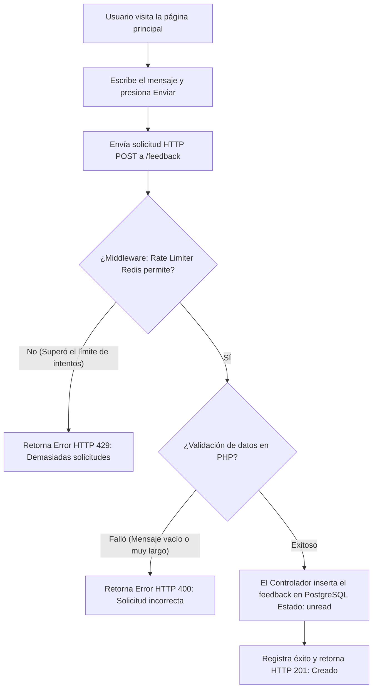
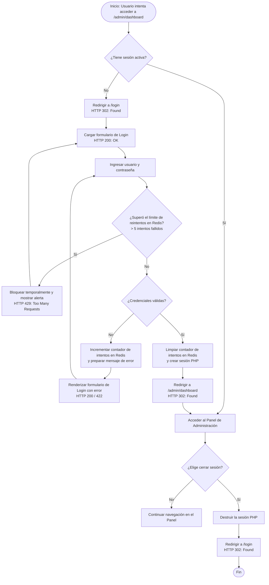
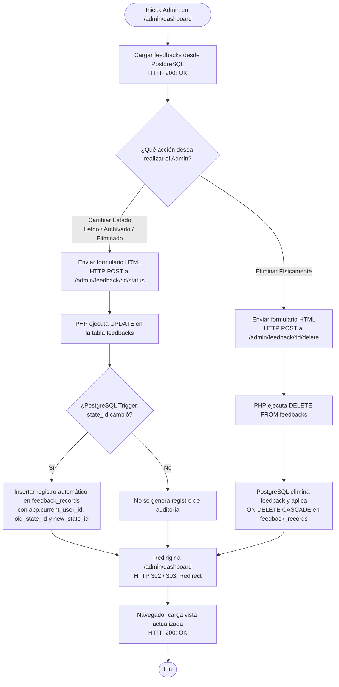

## Flujo 1: Recepción de Feedback Anónimo

```mermaid
flowchart TD
    A[Usuario visita la página principal] --> B[Escribe el mensaje y presiona Enviar]
    B --> C[Envía solicitud HTTP POST a /feedback]
    C --> D{¿Middleware: Rate Limiter Redis permite?}
    
    D -- No (Superó el límite de intentos) --> E[Retorna Error HTTP 429: Demasiadas solicitudes]
    D -- Sí --> F{¿Validación de datos en PHP?}
    
    F -- Falló (Mensaje vacío o muy largo) --> G[Retorna Error HTTP 400: Solicitud incorrecta]
    F -- Exitoso --> H[El Controlador inserta el feedback en PostgreSQL Estado: unread]
    
    H --> I[Registra éxito y retorna HTTP 201: Creado]

```

## Flujo 2: Autenticación y Control de Sesión del Administrador

```mermaid
flowchart TD
    A([Inicio: Usuario intenta acceder a /admin/dashboard]) --> B{¿Tiene sesión activa?}
    
    %% Ruta de sesión activa
    B -- Sí --> C[Acceder al Panel de Administración]
    
    %% Ruta sin sesión / Redirección
    B -- No --> D[Redirigir a /login\nHTTP 302: Found]
    D --> E[Cargar formulario de Login\nHTTP 200: OK]
    
    %% Bucle de intento
    E --> F[Ingresar usuario y contraseña]
    F --> G{¿Superó el límite de reintentos en Redis?\n> 5 intentos fallidos}
    
    %% Bloqueo por Fuerza Bruta
    G -- Sí --> H[Bloquear temporalmente y mostrar alerta\nHTTP 429: Too Many Requests]
    H --> E
    
    %% Validación de credenciales
    G -- No --> I{¿Credenciales válidas?}
    
    %% Credenciales incorrectas (Reintento)
    I -- No --> J[Incrementar contador de intentos en Redis\ny preparar mensaje de error]
    J --> K[Renderizar formulario de Login con error\nHTTP 200 / 422]
    K --> F
    
    %% Credenciales correctas
    I -- Sí --> L[Limpiar contador de intentos en Redis\ny crear sesión PHP]
    L --> M[Redirigir a /admin/dashboard\nHTTP 302: Found]
    M --> C
    
    %% Flujo de Logout
    C --> N{¿Elige cerrar sesión?}
    N -- No --> O[Continuar navegación en el Panel]
    N -- Sí --> P[Destruir la sesión PHP]
    P --> Q[Redirigir a /login\nHTTP 302: Found]
    Q --> R([Fin])
```

## Flujo 3: Gestión de Estados y Auditoría Automática

```mermaid
flowchart TD
    A([Inicio: Admin en /admin/dashboard]) --> B[Cargar feedbacks desde PostgreSQL\nHTTP 200: OK]
    B --> C{¿Qué acción desea realizar el Admin?}
    
    %% Ruta 1: Actualización de Estado (UPDATE)
    C -- Cambiar Estado\nLeído / Archivado / Eliminado --> D["Enviar formulario HTML\nHTTP POST a /admin/feedback/:id/status"]
    D --> E[PHP ejecuta UPDATE en la tabla feedbacks]
    
    %% Trigger en PostgreSQL
    E --> F{¿PostgreSQL Trigger:\nstate_id cambió?}
    F -- Sí --> G["Insertar registro automático en feedback_records\ncon app.current_user_id, old_state_id y new_state_id"]
    F -- No --> H[No se genera registro de auditoría]
    
    %% Ruta 2: Borrado Físico (DELETE)
    C -- Eliminar Físicamente --> I["Enviar formulario HTML\nHTTP POST a /admin/feedback/:id/delete"]
    I --> J[PHP ejecuta DELETE FROM feedbacks]
    J --> K["PostgreSQL elimina feedback y aplica\nON DELETE CASCADE en feedback_records"]
    
    %% Cierre del proceso (Patrón PRG)
    G --> L[Redirigir a /admin/dashboard\nHTTP 302 / 303: Redirect]
    H --> L
    K --> L
    L --> M[Navegador carga vista actualizada\nHTTP 200: OK]
    M --> N([Fin])
```