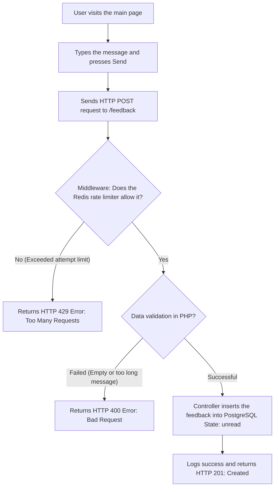
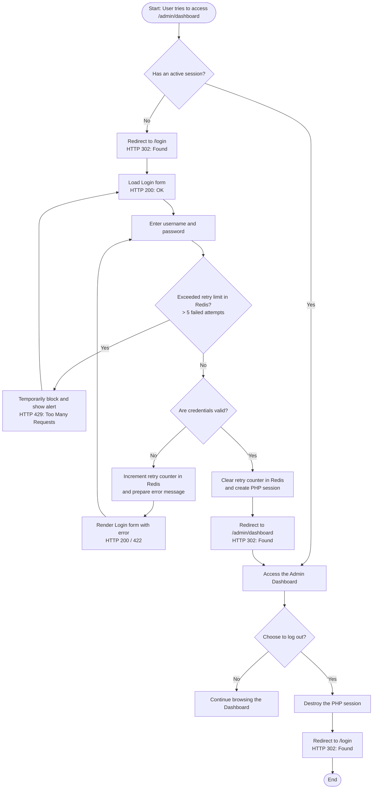
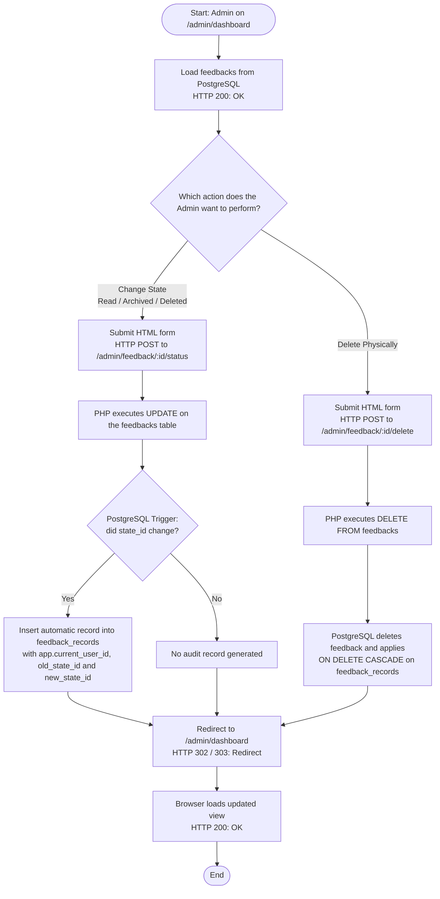

## Flow 1: Receiving Anonymous Feedback

```mermaid
flowchart TD
    A[User visits the main page] --> B[Types the message and presses Send]
    B --> C[Sends HTTP POST request to /feedback]
    C --> D{Middleware: Does the Redis rate limiter allow it?}
    
    D -- No (Exceeded attempt limit) --> E[Returns HTTP 429 Error: Too Many Requests]
    D -- Yes --> F{Data validation in PHP?}
    
    F -- Failed (Empty or too long message) --> G[Returns HTTP 400 Error: Bad Request]
    F -- Successful --> H[Controller inserts the feedback into PostgreSQL State: unread]
    
    H --> I[Logs success and returns HTTP 201: Created]

```

## Flow 2: Admin Authentication and Session Control

```mermaid
flowchart TD
    A([Start: User tries to access /admin/dashboard]) --> B{Has an active session?}
    
    %% Active session path
    B -- Yes --> C[Access the Admin Dashboard]
    
    %% No session / Redirect path
    B -- No --> D[Redirect to /login\nHTTP 302: Found]
    D --> E[Load Login form\nHTTP 200: OK]
    
    %% Attempt loop
    E --> F[Enter username and password]
    F --> G{Exceeded retry limit in Redis?\n> 5 failed attempts}
    
    %% Brute-force lockout
    G -- Yes --> H[Temporarily block and show alert\nHTTP 429: Too Many Requests]
    H --> E
    
    %% Credentials validation
    G -- No --> I{Are credentials valid?}
    
    %% Incorrect credentials (Retry)
    I -- No --> J[Increment retry counter in Redis\nand prepare error message]
    J --> K[Render Login form with error\nHTTP 200 / 422]
    K --> F
    
    %% Correct credentials
    I -- Yes --> L[Clear retry counter in Redis\nand create PHP session]
    L --> M[Redirect to /admin/dashboard\nHTTP 302: Found]
    M --> C
    
    %% Logout flow
    C --> N{Choose to log out?}
    N -- No --> O[Continue browsing the Dashboard]
    N -- Yes --> P[Destroy the PHP session]
    P --> Q[Redirect to /login\nHTTP 302: Found]
    Q --> R([End])

```

## Flow 3: State Management and Automatic Auditing

```mermaid
flowchart TD
    A([Start: Admin on /admin/dashboard]) --> B[Load feedbacks from PostgreSQL\nHTTP 200: OK]
    B --> C{Which action does the Admin want to perform?}
    
    %% Path 1: Update State (UPDATE)
    C -- Change State\nRead / Archived / Deleted --> D["Submit HTML form\nHTTP POST to /admin/feedback/:id/status"]
    D --> E[PHP executes UPDATE on the feedbacks table]
    
    %% PostgreSQL Trigger
    E --> F{PostgreSQL Trigger:\ndid state_id change?}
    F -- Yes --> G["Insert automatic record into feedback_records\nwith app.current_user_id, old_state_id and new_state_id"]
    F -- No --> H[No audit record generated]
    
    %% Path 2: Physical Deletion (DELETE)
    C -- Delete Physically --> I["Submit HTML form\nHTTP POST to /admin/feedback/:id/delete"]
    I --> J[PHP executes DELETE FROM feedbacks]
    J --> K["PostgreSQL deletes feedback and applies\nON DELETE CASCADE on feedback_records"]
    
    %% PRG pattern redirect
    G --> L[Redirect to /admin/dashboard\nHTTP 302 / 303: Redirect]
    H --> L
    K --> L
    L --> M[Browser loads updated view\nHTTP 200: OK]
    M --> N([End])

```
